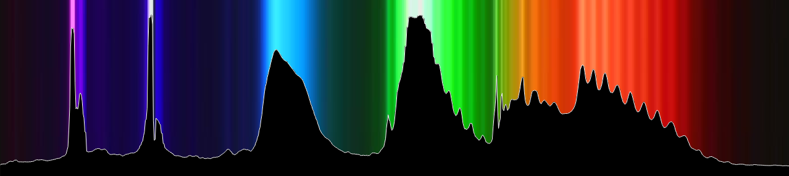
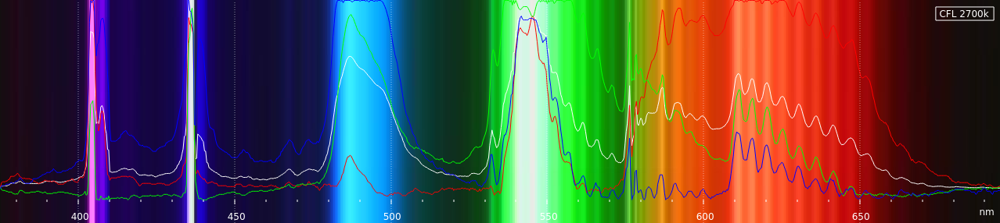
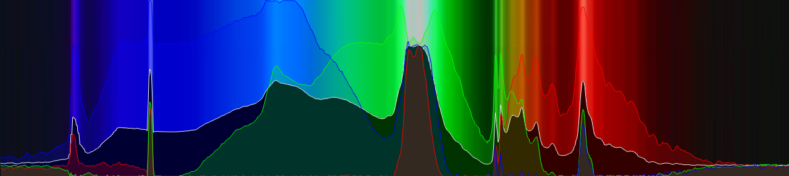
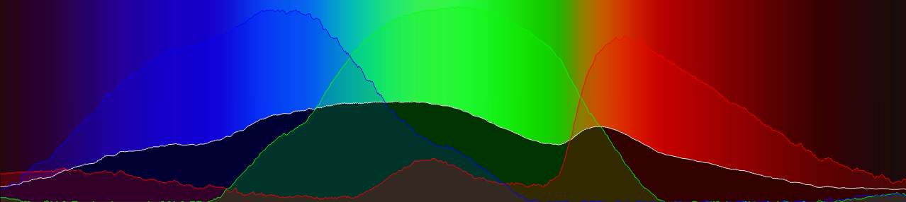

# Spectrometer


Based on Public Lab Spectrometer 3.0: https://publiclab.org/notes/abdul/10-13-2016/desktop-spectrometry-starter-kit-3-0-instructions

Using a USB camera module similar to:

- [Arducam OV5648](https://www.arducam.com/product/arducam-ov5648-auto-focus-usb-camera-ub0238-6/)
- [Newcamermodule 5MP CMOS Sensor](https://newcameramodule.com/product/small-size-5mp-cmos-sensor-usb-2-0-camera-module/)

Camera, diffraction grating, slit are mounted on magnets and placed on a metal sheet.  Positions adjusted until a clear spectrum is seen:


	
Covered with black paper to keep room light out.  The old enlarger head with its condensing lens and iris helps to focus the light on the diffraction grating and camera.  

Camera connected to Raspberry Pi (4), running Python/Pygame, Gnuplot, Bash

- Alignment is critical
- Focus is critical.  The camera I’m using  can be manually focused, but it’s not easy.  I hot-glued a tooth-pick to the side of the lens to make it easier to adjust.
- Exposure is critical.  Too much light will blur the spectrum.

---
## Averaging

```
$ ./spectrometer/average -h
usage: spectralAverage.py [-h] [-x WIDTH] [-y HEIGHT] [-v VIDEODEV] [-a AVERAGEITEMS] [-c PIXELCLIP]

Spectrometer

options:
  -h, --help            show this help message and exit
  -x WIDTH, --width WIDTH
  -y HEIGHT, --height HEIGHT
  -v VIDEODEV, --video VIDEODEV
  -a AVERAGEITEMS, --average AVERAGEITEMS
  -c PIXELCLIP, --clip PIXELCLIP
```

### Configuration file 

File located at: `python/config.ini`.  Commented entries indicate default values:

File | Description
-|-
[Spectrometer] | section header
#width=1280 | image width
#height=720 | image height
#videoDev=/dev/video0 | USB camera device
#averageItems=20 | number of frames to average
#pixelClip=250 | Out Of Range warning level
#calibDefault=',,410,900' | default calibration settings, HG463 and EU611


Select a line through the camera spectrum image:  


Click `AVERAGE`, and wait a few moments for the image to settle down.  If the value of a pixel exceeds the Out Of Range warning level, a red mark will appear at the top of the column.


Click on `prefix` to set the file name prefix (e.g. 'cfl').  Click on `decription` to set the description (e.g. 'CFL 2700K').  Click `SAVE`.

Output is a JPG of the resulting average, and a CSV with the average of each pixel and the averages of each color. 

---
## Calibration

```
$ ./spectrometer/calibrate -h
usage: calibrate [-h] CSVfile

Calibrate

positional arguments:
  CSVfile

options:
  -h, --help  show this help message and exit
```

Calibration uses __landmarks__ to calibrate the output:
- calibrate to landmarks in the spectrum (CFL Calibrate)
- calibrate to landmarks in the camera response (CIS Calibrate)


### Landmarks
[CFL Landmarks](https://commons.wikimedia.org/wiki/File:Fluorescent_lighting_spectrum_peaks_labelled.svg)

[CIS Landmarks](https://photo.stackexchange.com/questions/122037/why-do-typical-imaging-sensor-colour-filter-spectral-responses-differ-so-much-fr)
 Type|Wavelength|&nbsp;
 -|-|-
 __CFL__ | 405nm | mercury
 &nbsp; | 436nm | mercury
 &nbsp; | 487nm | terbium
 &nbsp; | 542nm | terbium
 &nbsp; | 546nm | mercury
 &nbsp; | 611nm | europium
 &nbsp; | &nbsp; | &nbsp;
 __CIS__ | 475nm | blue response peak
 &nbsp; | 515nm | green response peak
 &nbsp; | 580nm | red response peak
&nbsp; | &nbsp; | &nbsp;

### CFL Calibration

Click `CFL`.  Use the mouse to select the Eu611 peak on the right.  The keys Kp7,Kp9 (Q,E) can be used to fine-tune the selection.  Select the Hg436 peak on the left with the mouse; fine-tune with Kp1,Kp3 (Z,C):


Click `SAVE` - the settings are saved in that calibration file.


### CIS Calibration

Click `CIS`. Use the mouse to select the red response peak on the right and the blue response peak on the left.  Use the keys Kp7,Kp9 (Q,E) and Kp1,Kp3 (Z,C) to fine-tune the selection:


It’s doesn't have any prominate peaks, but it does have three noticeable bumps at the RGB peak sensitivities of the Color Imaging Sensor (CIS):

- Red: 580 nm
- Green: 515 nm
- Blue: 475 nm


Using those values for the scale gives a good match to the CFL calibration:


---
## Plotting

```
$ ./spectrometer/plot -h

Usage: ./spectrometer/plot [-H] [-I] [-L] [--CFL] [--CIS] [--INT] CSVfile

Plot Spectrum

Options:
    -H      Show this message
    -B      -B1 enable background image.  -B0 disable
    -L      -L1 enable landmarks display. -L0 disable
    --CFL   Plot pixel averages and CFL landmarks
    --CIS   Plot color averages and CIS landmarks
    --INT   Plot pixel averages as filled curve

    CSVfile Spectrum data to plot
```
Spectrum image and data are ploted in the range 375nm - 695nm.  Plot opens in gnuplot, use menu bar to save image.




You can also combine plotting options for different results:




