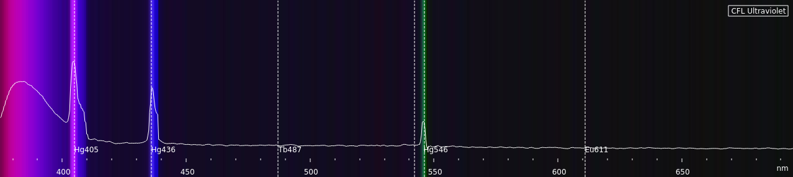
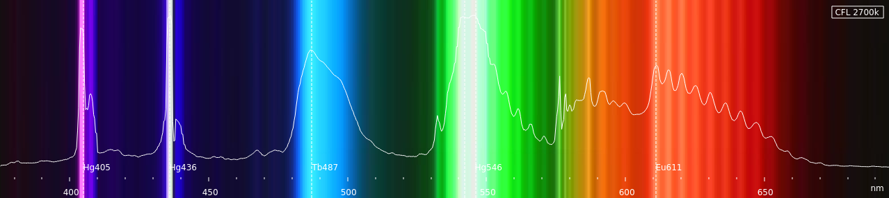
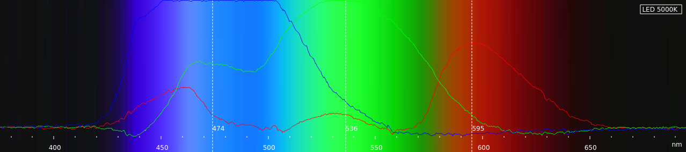

# Spectrometer


Based on Public Lab Spectrometer 3.0: https://publiclab.org/notes/abdul/10-13-2016/desktop-spectrometry-starter-kit-3-0-instructions

Using a USB camera module similar to:

- [Arducam OV5648](https://www.arducam.com/product/arducam-ov5648-auto-focus-usb-camera-ub0238-6/)
- [Newcamermodule 5MP CMOS Sensor](https://newcameramodule.com/product/small-size-5mp-cmos-sensor-usb-2-0-camera-module/)

Camera, diffraction grating, slit are mounted on magnets and placed on a metal sheet.  Positions adjusted until a clear spectrum is seen:


	
Covered with black paper to keep room light out.  The old enlarger head with its condensing lens and iris helps to focus the light on the diffraction grating and camera.  

Camera connected to Raspberry Pi (4)), running Python/Pygame, Gnuplot, Bash

- Alignment is critical
- Focus is critical.  The camera I’m using  can be manually focused, but it’s not easy.  I hot-glued a tooth-pick to the side of the lens to make it easier to adjust.
- Exposure is critical.  Too much light will blur the spectrum.


## Spectrum Averaging

`python/spectralAverage.py`


### Config file (`python/config.ini`):

File | Description
-|-
[Spectrometer]
#width=1280 | image width
#height=720 | image height
#videoDev=/dev/video0 | USB camera device
#averageItems=20 | number of frames to average
#pixelClip=250 | Out Of Range warning level
#calibDefault=',,410,900' | default calibration settings, HG463 and EU611

### Command line:
```
$ ./spectralAverage.py -h
usage: spectralAverage.py [-h] [-x WIDTH] [-y HEIGHT] [-v VIDEODEV] [-a AVERAGEITEMS] [-c PIXELCLIP]

Spectrometer

options:
  -h, --help            show this help message and exit
  -x WIDTH, --width WIDTH
  -y HEIGHT, --height HEIGHT
  -v VIDEODEV, --video VIDEODEV
  -a AVERAGEITEMS, --average AVERAGEITEMS
  -c PIXELCLIP, --clip PIXELCLIP
```

Select a line through the camera spectrum image:  


Click `AVERAGE`, and wait a few moments for the image to settle down:


which will get averaged over time and duplicated vertically:
Output is a JPG of the resulting average, and a CSV with the average of each pixel, and the averages of each color of each pixel. 
## Calibration

There are (at least) two ways to calibrate the output:
- calibrate to features in the spectrum (CFL Calibrate)
- calibrate to features of the camera (CIS Calibrate)


### CFL Calibration
The CFL spectrum has several clear landmarks: [CFL Landmarks](https://commons.wikimedia.org/wiki/File:Fluorescent_lighting_spectrum_peaks_labelled.svg)

Using the peaks at Hg436 and Eu611 gives this for the scale:


### CIS Calibration

But what about "smooth"" spectra:


 
It’s doesn't have any prominate peaks, but it does have three noticeable bumps at the RGB peak sensitivities of the Color Imaging Sensor (CIS):

- Red: 580 nm
- Green: 515 nm
- Blue: 475 nm

[Camera Spectral Response](https://photo.stackexchange.com/questions/122037/why-do-typical-imaging-sensor-colour-filter-spectral-responses-differ-so-much-fr)

Using those values for the scale gives a good match to the CFL calibration:


### Auto Calibration?

-- Seems like you should be able to take the RGB values of a pixel, convert it to HSV, then map the Hue (H) to Wavelength (nm).  Almost works, but not quite… 

## Plotting

## Different Light Sources






### Intensity

