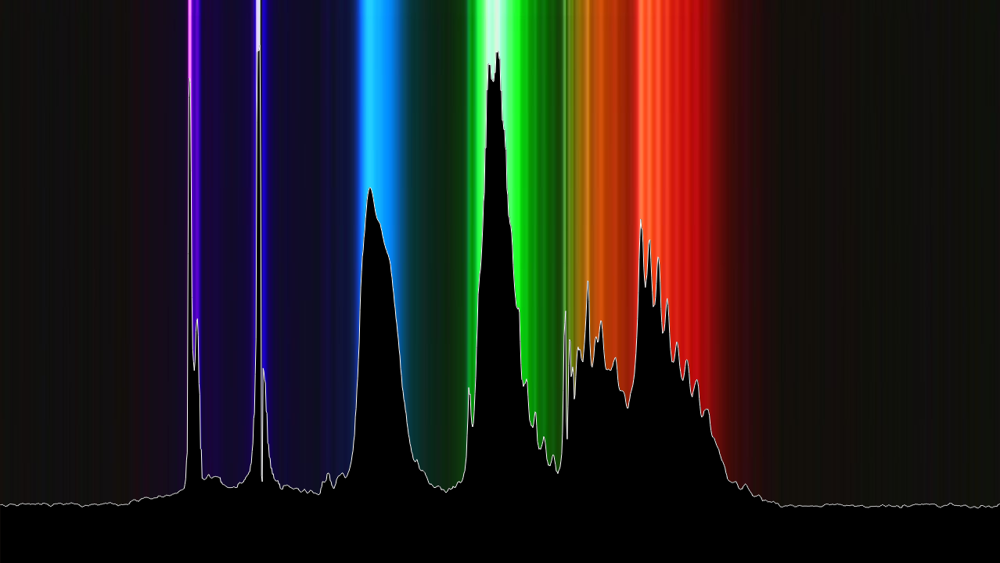
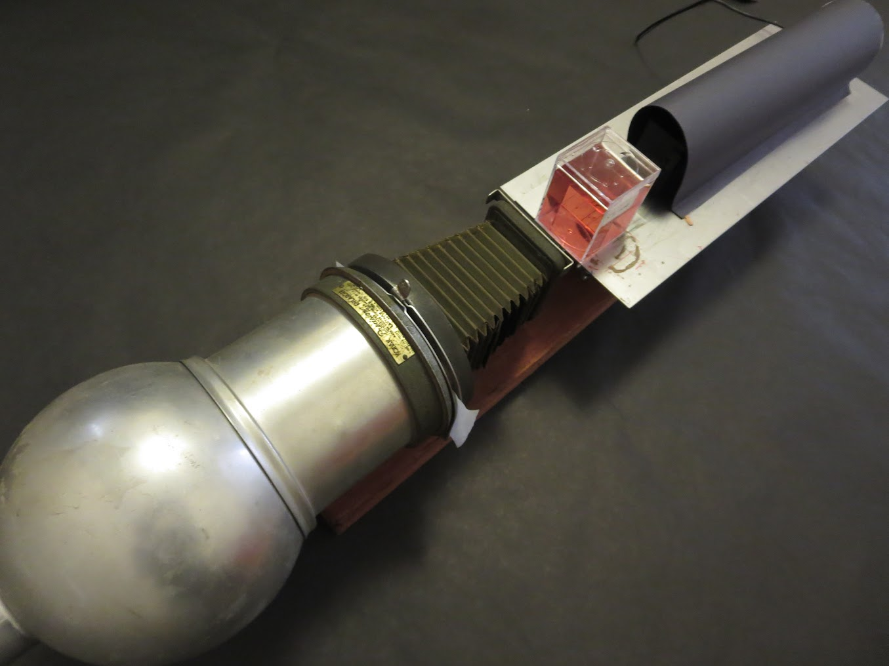
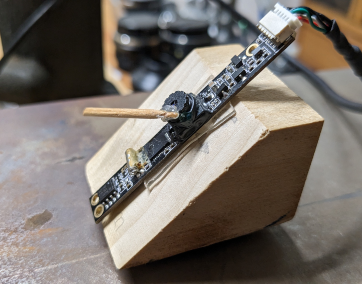
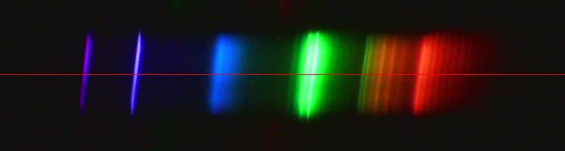
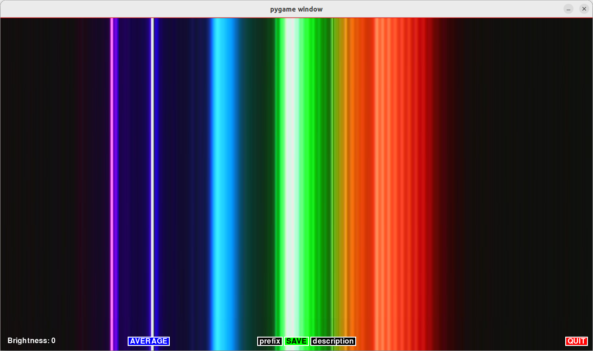
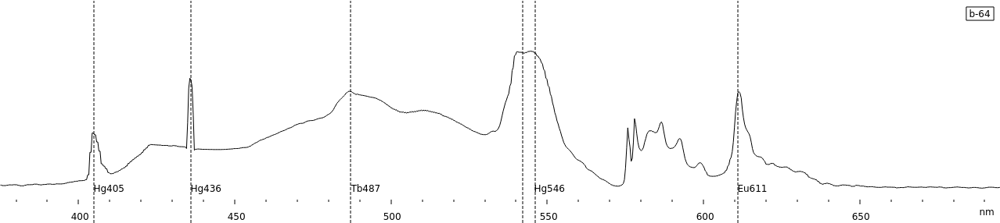
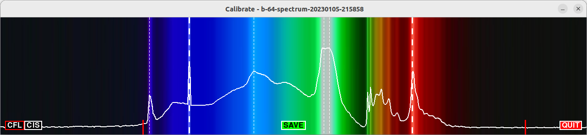
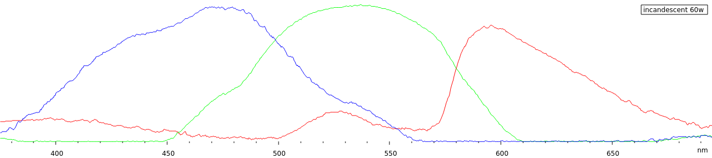
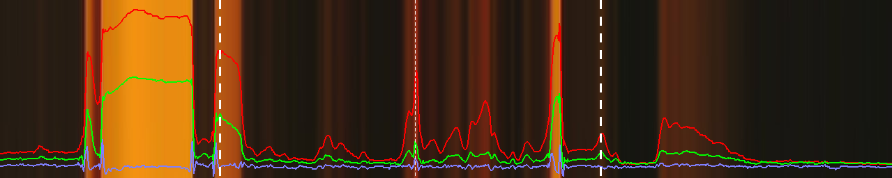
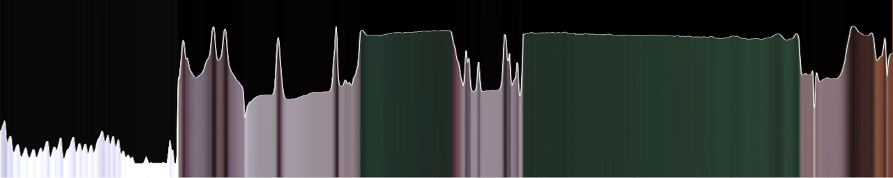

# Spectrometer


Based on Public Lab's [Spectrometer 3.0](https://publiclab.org/notes/abdul/10-13-2016/desktop-spectrometry-starter-kit-3-0-instructions)

Python scripts to select, average, and calibrate spectrum data from USB spectrometer. Plotting with Gnuplot.  Running on Raspberry Pi.

## Setup

### Alignment
- Camera, diffraction grating, slit, mounted on magnets and arranged on a metal sheet:

|  |
|:-:|	
| Enlarger head with condensing lens and iris to focus light on the diffraction grating

### Focus
- Camera should be focused on the collimation slit, approximately 200mm away.

|  |
|:-:|
| Camera with Focusing Aid |
### Exposure
- Over exposure will clip the image and make it difficult to find peaks
- Reduce camera brightness to get a solid black background

---
## Average


```
$ ./spectrometer/average -h
usage: average [-h] [-x WIDTH] [-y HEIGHT] [-v VIDEODEV] [-a AVERAGEITEMS] [-c PIXELCLIP]

Spectrometer

options:
  -h, --help            show this help message and exit
  -x WIDTH, --width WIDTH
  -y HEIGHT, --height HEIGHT
  -v VIDEODEV, --video VIDEODEV
  -a AVERAGEITEMS, --average AVERAGEITEMS
  -c PIXELCLIP, --clip PIXELCLIP
```

### Configuration file 

File located at: `./spectrometer/config.ini`.  Commented entries indicate default values:

File | Description
-|-
[Spectrometer] | section header
#width=1280 | image width
#height=720 | image height
#videoDev=/dev/video0 | USB camera device
#averageItems=20 | number of frames to average
#pixelClip=250 | Out Of Range warning level
#calibDefault=',,410,900' | default calibration settings, HG463 and EU611


Select a line through the camera spectrum image:  



Click `AVERAGE`, and wait a few moments for the image to settle down.  If the value of a pixel exceeds the Out Of Range warning level, a red mark will appear at the top of the column.




Click on `prefix` to set the file name prefix (e.g. 'cfl').  Click on `decription` to set the description (e.g. 'CFL 2700K').  Click `SAVE`.

Output is a JPG of the resulting average, and a CSV with the average of each pixel and the averages of each color. 

---
## Calibrate

```
$ ./spectrometer/calibrate -h
usage: calibrate [-h] CSVfile

Calibrate

positional arguments:
  CSVfile

options:
  -h, --help  show this help message and exit
```

Calibration uses __landmarks__ to calibrate the output:
- calibrate to landmarks in the spectrum (__CFL Calibration__)
- calibrate to landmarks in the camera response (__CIS Calibration__)


---
### CFL Calibration

[CFL Landmarks](https://commons.wikimedia.org/wiki/File:Fluorescent_lighting_spectrum_peaks_labelled.svg)


 Type|Wavelength|&nbsp;
 -|-|-
 __CFL__ | 405nm | mercury
 &nbsp; | 436nm | mercury
 &nbsp; | 487nm | terbium
 &nbsp; | 542nm | terbium
 &nbsp; | 546nm | mercury
 &nbsp; | 611nm | europium
 &nbsp; | &nbsp; | &nbsp;

Click `CFL`.  Use the mouse to select the Eu611 peak on the right.  The keys Kp7,Kp9 (Q,E) can be used to fine-tune the selection.  Select the Hg436 peak on the left with the mouse; fine-tune with Kp1,Kp3 (Z,C):



Click `SAVE` - the settings are saved in the calibration file.

---
### CIS Calibration

[CIS Landmarks](https://photo.stackexchange.com/questions/122037/why-do-typical-imaging-sensor-colour-filter-spectral-responses-differ-so-much-fr)

 Type|Wavelength|&nbsp;
 -|-|-
 __CIS__ | 465nm | blue response peak
 &nbsp; | 532nm | green response peak
 &nbsp; | 596nm | red response peak
 &nbsp; | 529nm | the red bump
&nbsp; | &nbsp; | &nbsp;


Click `CIS`. Use the mouse to select the red response peak on the right and the blue response peak on the left.  Use the keys Kp7,Kp9 (Q,E) and Kp1,Kp3 (Z,C) to fine-tune the selection:


Click `SAVE` - the settings are saved in the calibration file.


---
## Plot

```
$ ./spectrometer/plot -h

Usage: ./spectrometer/plot [-H] [-I] [-L] [--CFL] [--CIS] [--INT] CSVfile

Plot Spectrum

Options:
    -H      Show this message
    -B      -B1 enable background image.  -B0 disable
    -L      -L1 enable landmarks display. -L0 disable
    --CFL   Plot pixel averages and CFL landmarks
    --CIS   Plot color averages and CIS landmarks
    --INT   Plot pixel averages as filled curve

    CSVfile Spectrum data to plot
```
Spectrum data is ploted with the spectrum background image in the range 375nm - 695nm.  Plot opens in gnuplot; use menu bar to save image.


You can also combine the plot options for different results:



